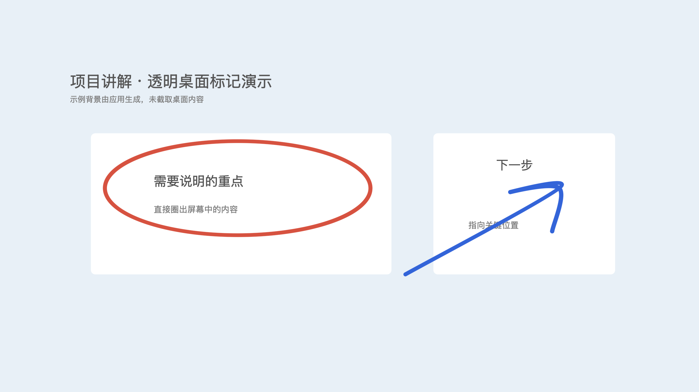

# Zkalan InkDeck · 触控板手写与桌面标记

用 MacBook 触控板的绝对位置写字、画图，也可以直接在桌面上圈画讲解。手指抬起后，下一笔从新的接触位置开始，不会连接到上次落点。

原生 Swift / AppKit，Apple Silicon，macOS 13 及以上，无第三方运行依赖。单指书写、轻触速度辅助、Force Touch 压力与模拟毛笔，主要操作直接按单键。

[下载预览应用](https://github.com/zkalan/zkalan-inkdeck/raw/refs/heads/main/downloads/ZkalanInkDeck-0.4.0-macOS-arm64.zip) · [下载与校验文件](downloads) · [验证记录](artifacts/v0.4/VALIDATION.md) · [版本说明](CHANGELOG.md) · [代码来源与依赖](PROVENANCE.md)

当前提供 0.4.0 预览包。模型检查 49 项通过；最后一轮前台输入回归被测试 Mac 的锁屏状态阻止，尚未完成。已保留实际检查结果和验证边界，供试用时参考。



上图是合成背景与标记的演示，不是用户桌面截图。

## 打开

从本仓库的 `downloads` 下载 `ZkalanInkDeck-0.4.0-macOS-arm64.zip`，解压后将应用拖到「应用程序」或 `~/Applications`，双击打开。窗口副标题为 `0.4 · 桌面透明标记`，原型旧称「触控板手写 2」，新版会读取已有草稿。

这是可试用的原型，采用本地临时签名，尚无 Developer ID 签名或 Apple 公证。首次打开下载包可能被 macOS 拦截；确认来源后按 [Apple 的官方说明](https://support.apple.com/zh-cn/102445)操作，也可以按下文从源码构建。下载目录附有 SHA-256 校验文件。

界面改为两行紧凑工具栏和单行状态栏，说明收进「帮助」弹出面板。默认 1180 × 830 内容区内，白色画布为 1166 × 728.75 点，占约 86.8%；窗口改变时保持触控板比例，避免笔迹被拉伸。

构建产物在 `dist/Zkalan InkDeck.app`。适用于 Apple Silicon Mac，最低 macOS 13；本机编译环境为 macOS 26.5.1 / Swift 6.3.2。应用使用本地临时签名。

## 桌面标记

1. 先打开要讲解的网页、文档或软件。在手写应用中按 **F**，或点击系统菜单栏的**画笔图标 → 开始 / 退出桌面标记**。
2. 主画板隐藏，当前屏幕出现透明标记层和小工具条。先抬手，再用单指在触控板上圈画；触控板四角对应当前屏幕四角。
3. 按 **Enter** 暂停标记，鼠标点击和滚动会穿过标记层，可以翻页或操作下面的软件。已有标记保持可见。
4. 点击工具条的 **继续标记** 恢复书写。暂停时可调整红 / 蓝 / 绿 / 黑、普通笔 / 毛笔与笔宽，也可以拖动工具条。
5. 按 **Esc** 或 **F** 退出并返回画板。退出只隐藏标记，再次进入可以继续。

| 桌面模式按键 | 操作 |
| --- | --- |
| `F` / `Esc` | 退出桌面标记 |
| `Enter` | 暂停并操作桌面；恢复时点击「继续标记」 |
| `Z` / `Y` | 撤销 / 重做桌面笔画 |
| 按住空格 | 预览落点，松开恢复书写 |
| `C` | 清空当前屏幕标记，先显示确认框 |
| `H` | 打开 / 收起桌面帮助 |
| 「换屏」 | 多显示器之间切换，一次在一块屏幕上标记 |

快捷键只在本应用接收键盘输入时生效。在其他软件里打字不会触发 F / Z / C；从其他软件进入请使用菜单栏画笔图标。关闭主画板后菜单栏入口仍保留，完全退出请使用菜单中的「退出触控板手写」或 `⌘ Q`。

桌面模式使用实时透明窗口，不采集桌面图像、不需要录屏权限。为避免标记错位，该模式固定视图，双指只暂停落笔；画板模式仍支持平移和缩放。标记固定在屏幕坐标，下面的窗口移动或页面滚动后，标记不会跟随某个元素移动，可清空后重新标注。

远程讲解时请选择**共享整个屏幕**。只共享某个应用窗口时，会议软件可能不会带上透明标记层；实际效果需在所用会议软件中确认。不同软件的原生全屏空间兼容性和多显示器实物切换仍需进一步试用。

## 书写与导航

| 操作 | 效果 |
| --- | --- |
| `Enter` 或点击「开始书写」 | 开始 / 结束书写；开始后先抬手再用单指轻触 |
| 单指接触、移动、抬起 | 从对应位置落笔，抬手断笔 |
| 双指一起移动 | 平移画布，可向四周继续创作 |
| 双指张合 | 以两指中心为锚点缩放，可以同时平移 |
| `=`（与 `+` 同一键） / `−` | 放大 / 缩小，无需按 Shift，范围为 10%–1600% |
| `0` 或「原位」 | 返回初始位置和 100% 缩放 |
| `9` 或「全部」 | 尽量将所有笔迹放进视窗 |
| 「拖动」 | 退出书写，使用鼠标或按住触控板拖动画布 |
| 按住空格 | 预览落点，松开后恢复书写 |
| `Esc` | 结束书写并恢复普通光标 |
| `Z` / `Y` | 撤销 / 重做笔画，普通浏览和书写时均可使用 |
| `S` 或「导出 PNG」 | 导出整幅作品 |
| `H` 或「帮助」 | 打开 / 收起快捷键和输入说明；打开时结束书写 |
| `F` 或「桌面标记」 | 进入当前屏幕的透明标记模式 |

主要快捷键都直接按单键。菜单「编辑」「书写」「视图」「帮助」列出对应按键，按钮悬停也有提示。输入文件名、编辑文本或打开对话框时暂停画布快捷键。保留 `⌘ Z`、`⇧⌘ Z`、`⌘ S` 等兼容操作；`⌘ H` 交回系统处理。

触控板四角始终对应当前可见白色画布的四角。缩放或移动画布后，新的落点会经过相同的坐标变换；已有笔迹保存在世界坐标中，不会被反复缩放或降采样。方格随画布移动，可作为定位参考。

双指手势结束后，请把两根手指都抬起，再以单指继续写。这样不会把剩下的一根手指误当成新笔画。检测到三个以上接触点时暂停，直到全部抬手。手指悬空时没有新的接触坐标，接触后才更新位置。

## 压感与毛笔

- **轻触增强（默认）**：轻触移动时，慢速略粗、快速略细；按压后叠加真实压力。无需按下触控板，也能得到连续的粗细变化。
- **纯压感**：普通笔只按实际硬件压力变化，不混入速度辅助。
- **关闭压感**：普通笔保持等宽；毛笔仍保留自身的速度变化与起收笔造型。
- **毛笔**：压力控制粗细，同时按移动速度调节，完成笔画时呈现起笔、收笔尖锋。这是模拟毛笔，不模拟真实笔毛、墨水扩散或笔杆倾斜。
- **笔宽**：调节基准粗细。放大画细节时可以向左调细。
- **灵敏度**：向右调节，可用较小力度得到更明显的粗细变化。默认 2，范围 0.5–5；采用连续曲线增强小压力，粗细过渡按时间平滑处理。

压感通过公开 AppKit `pressureChange(with:)` 和 `NSPressureConfiguration(.primaryGeneric)` 读取真实 Force Touch 数据。[Apple 的此压力模式](https://developer.apple.com/documentation/appkit/nsevent/pressurebehavior-swift.enum/primarygeneric)在按下触控板后进入压力事件流。应用无法提前取得尚未发送的硬件压力，因此轻触增强明确使用速度辅助。第二行「原始力度」始终显示真实压力百分比，不把速度变化显示成压力。

默认曲线将 2% 原始压力映射到约 20% 的压力响应，10% 原始压力映射到约 57%，随后继续平滑增加到满量程。比例指软件响应，不能换算成手指的实际受力。硬件采样和手感需要本机试写确认。

## 保存与导出

- 新版草稿：`~/Library/Application Support/TrackpadInk/draft-v2.json`。
- 桌面标记：`~/Library/Application Support/TrackpadInk/desktop-draft.json`，按显示器分别记录，与画板草稿独立。
- 旧版草稿：`~/Library/Application Support/TrackpadInk/draft.json`，新版不覆盖它。
- 新版草稿不存在时读取旧版草稿，保留原有等宽笔迹。后续自动保存到新版文件，包含笔画逐点粗细、笔刷类型和视窗位置。
- PNG 包含全部笔迹，不限于屏幕可见范围，最长边 4096 像素；保留比例、白色背景，不包含方格或笔尖。完整矢量采样细节仍在草稿中。
- PNG 导出入口属于普通画板；桌面模式当前不提供背景截图导出。

## 实际验证

1. 上方画一横，抬手后在下方再画一横，检查仍是两笔独立线段。
2. 用双指把已画内容移到一边，在空白处继续画，再点「显示全部」。已有内容和新内容应同时出现。
3. 放大到约 250%，在原笔迹附近补一个小细节，再缩小，检查相对位置不变。
4. 双指操作后先只抬起一指：剩余手指不应留下笔迹。全部抬手后恢复单指书写。
5. 选择「轻触增强」和普通笔，不按下触控板，交替慢画和快画，检查粗细过渡；再切到「纯压感」，按下后轻微加力，检查原始力度与笔宽一起变化。
6. 选择毛笔，写一条弯线后抬手，检查粗细过渡与收笔尖锋。
7. 将部分笔迹移出视窗后导出，检查 PNG 仍包含所有内容。
8. 退出并重启，检查作品及视窗状态恢复。
9. 直接按 `Z` 撤销、`Y` 重做；按 `H` 查看帮助，再按一次收起。导出时在文件名中输入 z、y、s 等字母，画稿不应改变。
10. 从菜单栏进入桌面标记，圈出下面的软件元素；Enter 暂停后点击/滚动该软件，再恢复标记。检查退出后光标正常、主画板内容未变。

## 构建与检查

无需第三方依赖，安装 Apple Command Line Tools 后执行：

```sh
zsh scripts/build.sh
zsh scripts/test.sh
mkdir -p artifacts/v0.4
TRACKPAD_INK_ARTIFACTS="$PWD/artifacts/v0.4" 'dist/Zkalan InkDeck.app/Contents/MacOS/ZkalanInkDeck' --smoke-test
zsh scripts/package.sh
```

测试需要在能够连接 macOS 桌面的会话中运行。49 项模型检查覆盖旧版分笔、视窗变换、双指导航、低压力曲线、零压力速度辅助、缩放无关的速度、不同采样率下的平滑一致性、毛笔效果和草稿兼容。应用内检查走相同的触控路由与渲染代码，并验证键盘事件、菜单单键、文本编辑保护、帮助面板和实际画布面积。

`artifacts/v0.4/` 存放结果 JSON、画板与桌面工具条、帮助、透明层、合成演示及导出图片。低压力示例从上到下为原始压力 0%、2%、10%，每条线交替慢速和快速；这些是合成输入。自动测试不读取或修改用户草稿，也不截取桌面内容，不能替代真实硬件触控、压力采样和手感测试。

`scripts/package.sh` 将已构建应用、说明文档和验证制品打包到 `release/` 并生成 SHA-256。源码和测试制品保存在仓库，当前预览应用 ZIP 与验证 ZIP 存放在公开的 `downloads/` 目录；正式 Release 待最终前台回归完成后补充。

## 技术边界

- AppKit `NSTouch` 绝对坐标，公开 CoreGraphics 光标控制；没有私有触控框架或网络请求。
- 书写模式使用原始双指中心与距离统一计算平移和缩放，同时忽略系统滚动/缩放回调，避免同一手势应用两次。普通浏览状态使用系统滚动和缩放事件。
- 画笔使用每点粗细和曲线生成矢量轮廓，缓存笔画路径；视窗移动时复用路径，并剔除不可见笔画。
- 退出、失焦、最小化或调整窗口会结束书写模式并配对恢复光标。
- 桌面使用透明 `NSPanel`，通过公开 `ignoresMouseEvents` 切换操作穿透；绘制时使用 1% 底色让透明区域参与系统命中，暂停时移除此底色。已验证透明窗口中心可以命中手写应用。

参考：[Apple 触控事件](https://developer.apple.com/library/archive/documentation/Cocoa/Conceptual/EventOverview/HandlingTouchEvents/HandlingTouchEvents.html)、[压力配置](https://developer.apple.com/documentation/appkit/nspressureconfiguration)、[压力事件](https://developer.apple.com/documentation/appkit/nsresponder/pressurechange(with:))。
